# URL Audit Feature - Visual Diagrams

This file contains Mermaid diagrams that can be rendered in GitHub, GitLab, or any Mermaid-compatible viewer.

## System Architecture

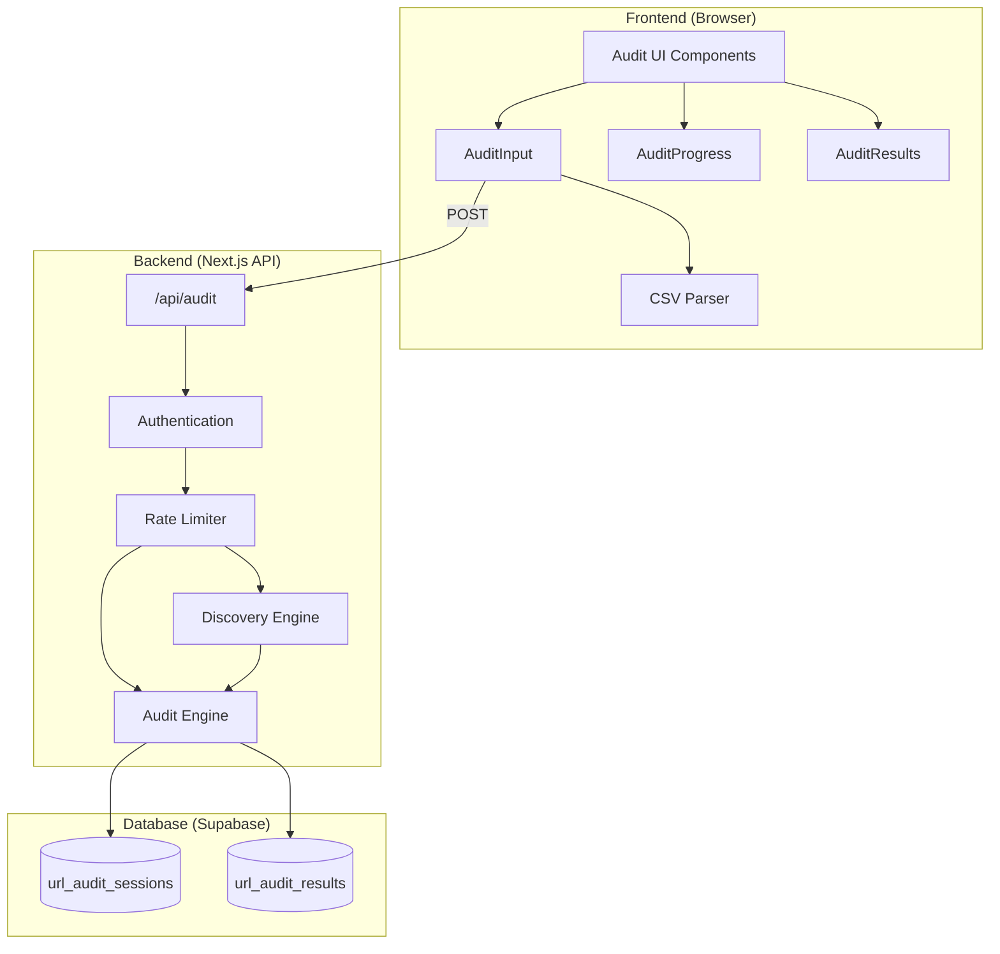

## Audit Modes

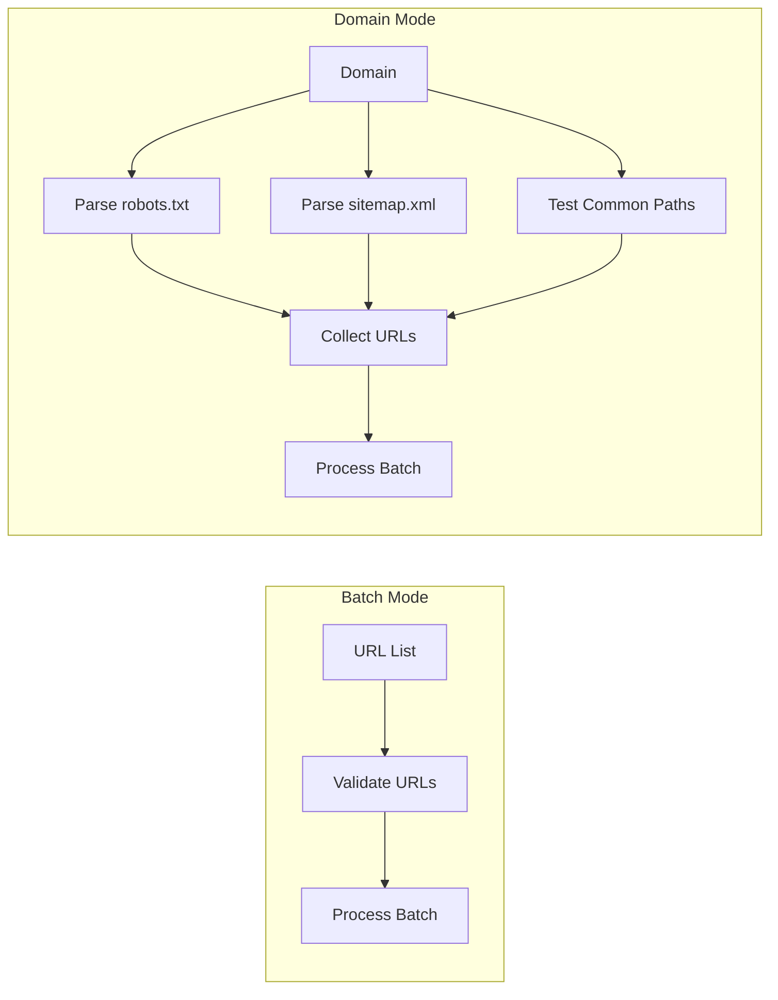

## URL Testing Pipeline

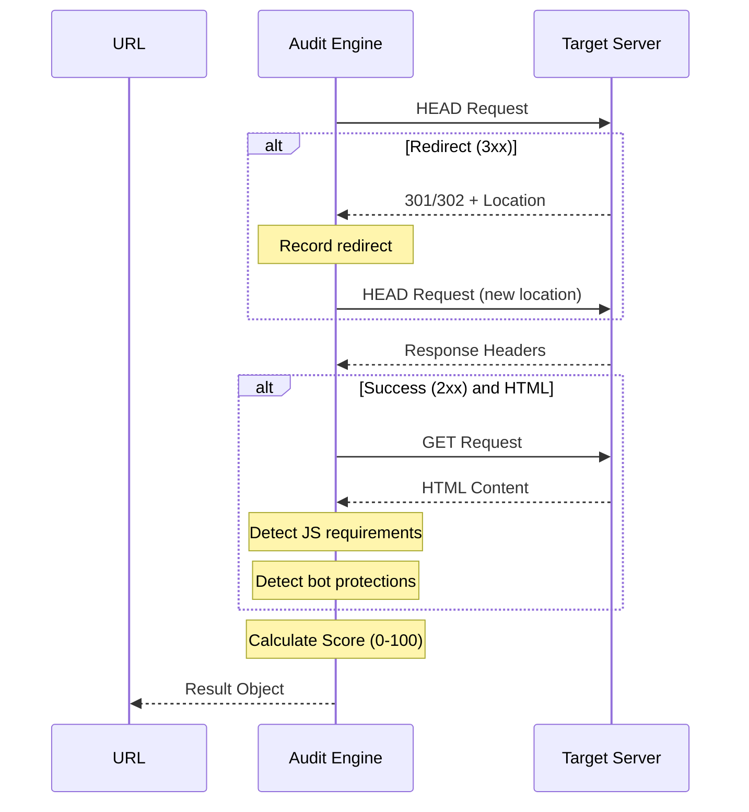

## Scoring Algorithm

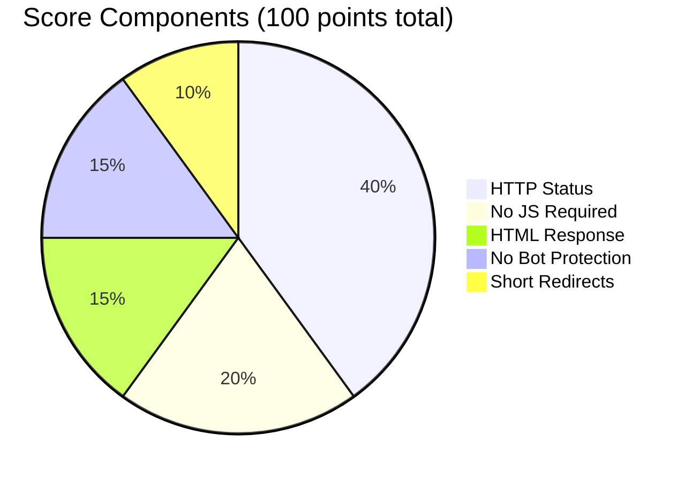

## Score Calculation Flow

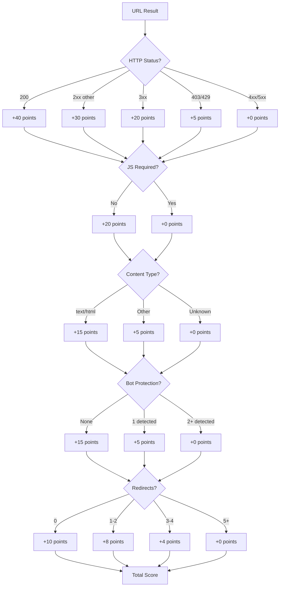

## Recommendation Logic

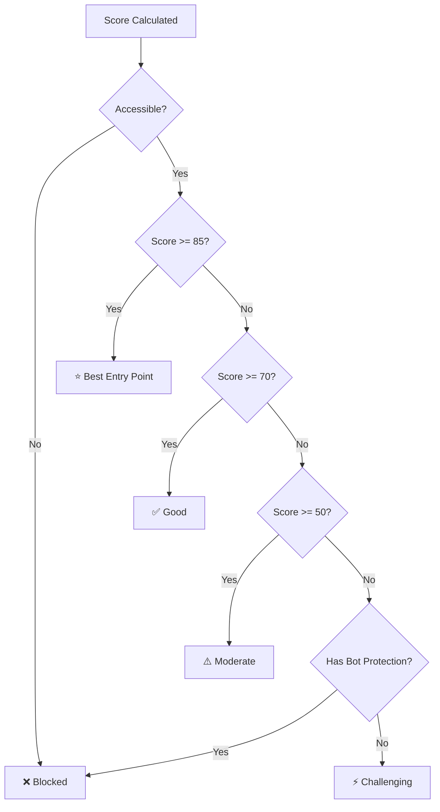

## Domain Discovery Flow

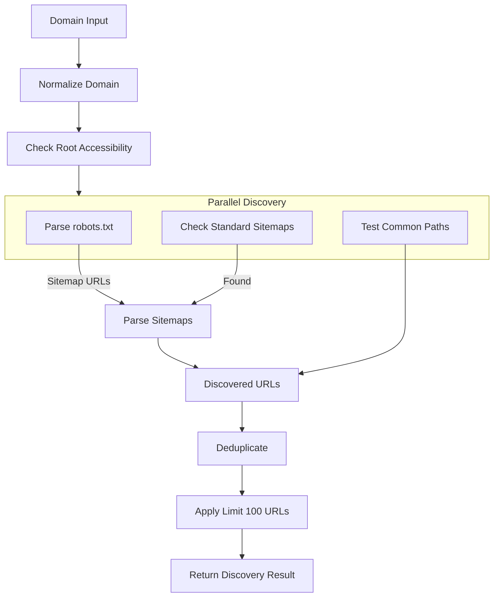

## Component Hierarchy

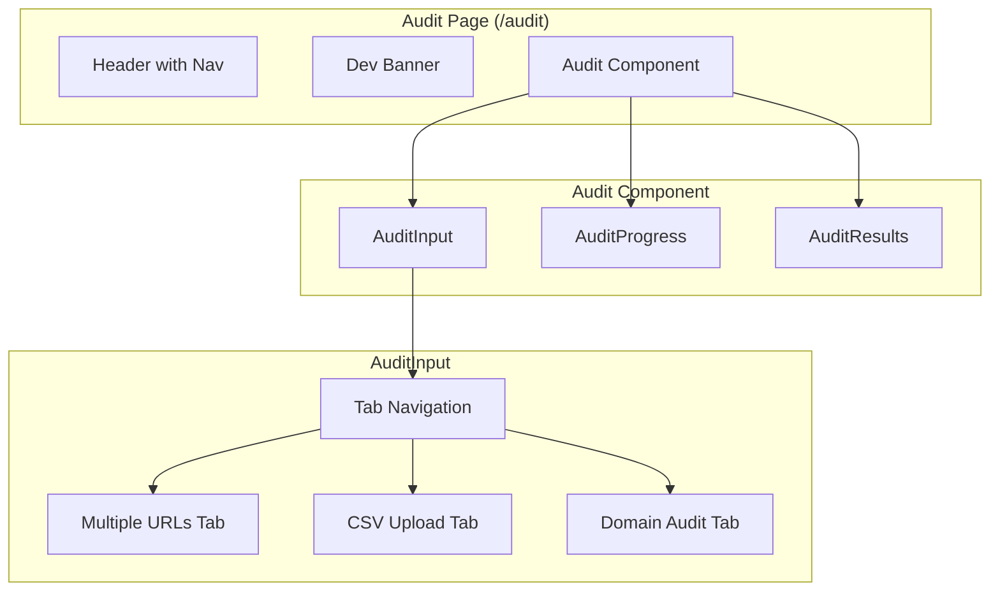

## Data Model (ER Diagram)

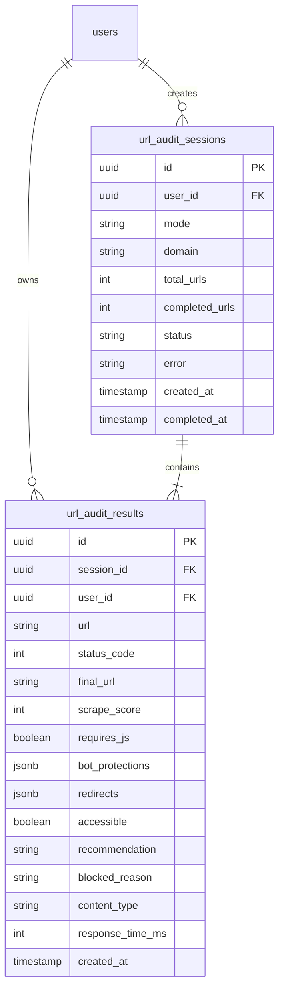

## State Machine

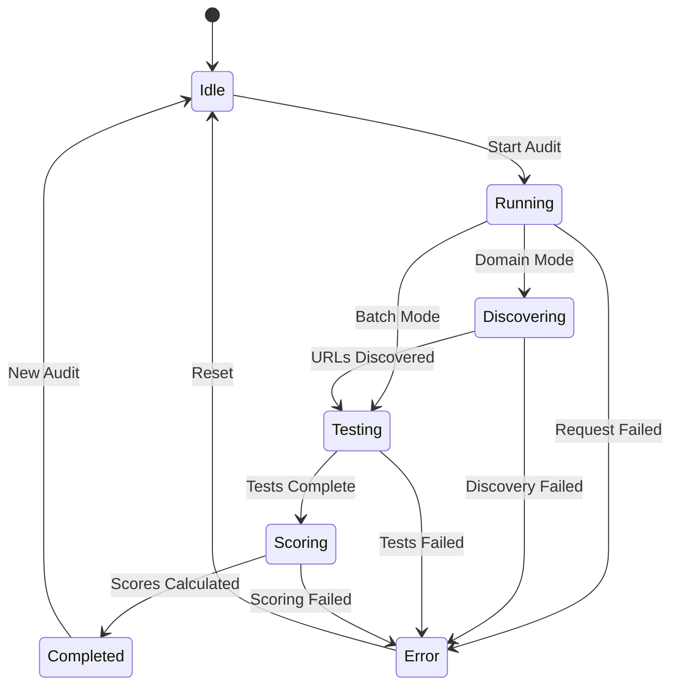

## API Request/Response Flow

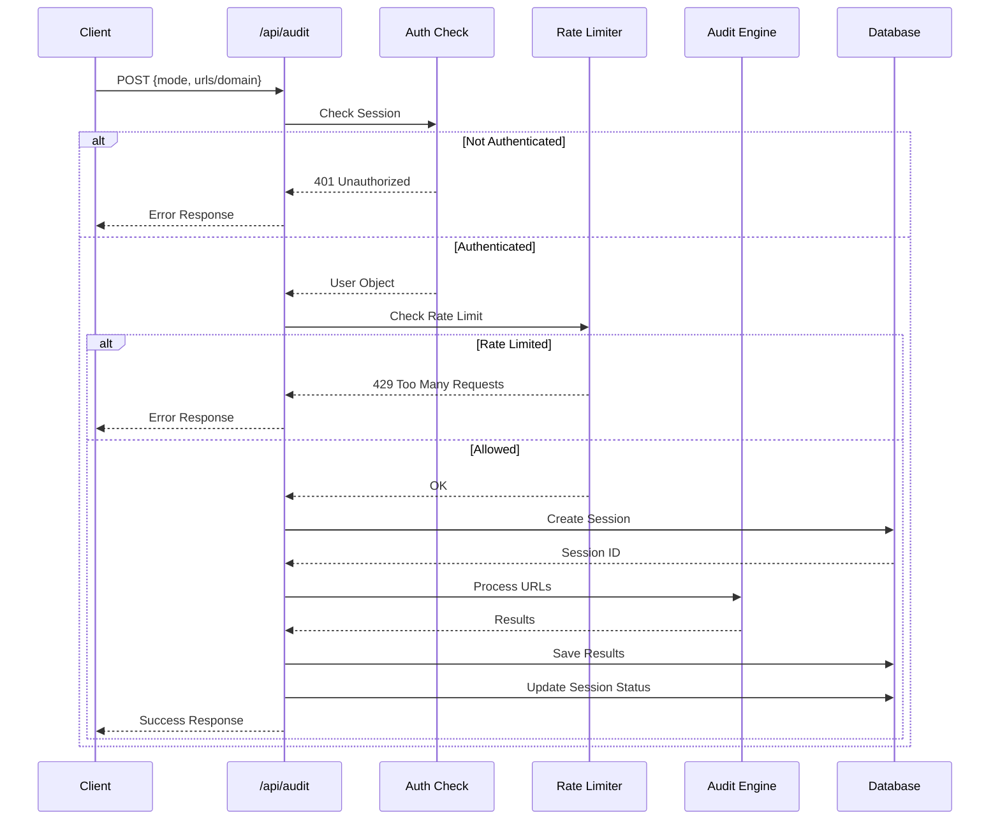

---

## Usage

These diagrams can be viewed directly on:
- GitHub (native Mermaid support)
- GitLab (native Mermaid support)
- VS Code with Mermaid extension
- [Mermaid Live Editor](https://mermaid.live)

To render locally, you can use:
```bash
npm install -g @mermaid-js/mermaid-cli
mmdc -i AUDIT_DIAGRAMS.md -o audit_diagrams.pdf
```
